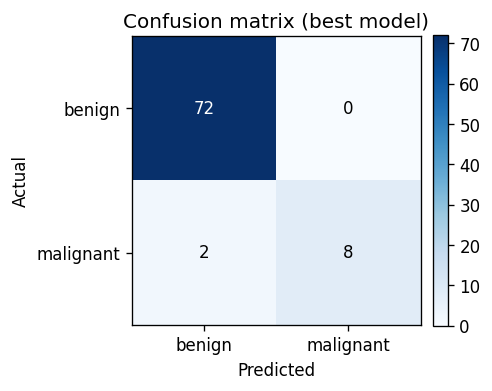
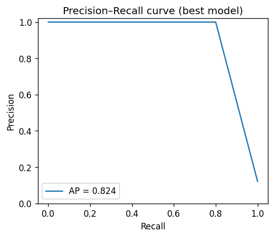

<div align="center">

</div>

# Medical Report Classifier — Imbalanced Supervised ML

[](https://github.com/ashishlandiwal/medical-report-classifier/actions/workflows/ci.yml)


An end-to-end supervised-learning project that compares **six classifiers** on a medical
diagnosis task, handles **class imbalance with SMOTE**, tracks experiments with **MLflow**,
ships a **model card**, and serves an interactive **Streamlit** dashboard.

The emphasis is the part that actually matters in healthcare ML: **recall on the minority
(malignant) class** — because a false negative is a missed cancer — and being honest about
the small-sample limitations.

## Dataset

Breast Cancer Wisconsin (Diagnostic), bundled with scikit-learn (569 samples, 30 real-valued
features). Labels are flipped so `1 = malignant` (the positive class we must not miss). To
study imbalance honestly, the malignant class is **deliberately down-sampled to ~12%
prevalence** in training — emulating the skew of real screening data — and the effect of
SMOTE is then measured.

## Approach

- Each of six models is run in two configurations: **baseline** and **with SMOTE** (applied
  inside an `imblearn` pipeline so oversampling never leaks into the test set).
- All models share a `StandardScaler` front-end; the split is stratified; everything is seeded.
- Selection metric is **macro-F1**; the malignant-class recall and ROC/PR-AUC are reported
  alongside.

## Results (held-out test set)

> Reproduced live by `python -m medclf.train`; metrics below are from the committed
> [`reports/metrics.json`](reports/metrics.json) and [`reports/model_card.md`](reports/model_card.md).

**Best model: `KNN` + SMOTE**

| Metric | Value |
|---|---|
| Accuracy | **97.6%** |
| F1 (macro) | **93.8%** |
| Precision (malignant) | 100.0% |
| Recall (malignant) | 80.0% |
| F1 (malignant) | 88.9% |
| ROC-AUC | 0.900 |
| PR-AUC | 0.824 |

**Macro-F1 for every model, baseline vs SMOTE:**

| Model | Baseline | SMOTE |
|---|---|---|
| Logistic Regression | 0.902 | 0.902 |
| KNN | 0.902 | **0.938** |
| Naive Bayes | 0.911 | 0.875 |
| Decision Tree | 0.817 | 0.902 |
| Random Forest | 0.817 | 0.817 |
| SVM | 0.766 | 0.766 |

**Effect of SMOTE on minority recall (best model):** `0.70 → 0.80` — oversampling recovers
sensitivity to the malignant class that the imbalanced baseline misses.

<p align="center">
  
  
</p>

## Quickstart

```bash
pip install -r requirements.txt

# Train all models, write metrics + plots + model card to reports/
make train            # or: PYTHONPATH=src python -m medclf.train --no-mlflow

# Track the same runs in MLflow
pip install -r requirements-optional.txt
PYTHONPATH=src python -m medclf.train          # logs to ./mlruns
mlflow ui

# Interactive dashboard
streamlit run app/streamlit_app.py
```

Docker (builds the model and serves the dashboard on :8501):

```bash
docker build -t medical-report-classifier . && docker run --rm -p 8501:8501 medical-report-classifier
```

## Project structure

```
src/medclf/
  data.py         # dataset load + controlled imbalance simulation
  models.py       # the six classifiers
  train.py        # baseline vs SMOTE experiment, MLflow logging, artifact export
  evaluate.py     # metrics + confusion-matrix / PR-curve plots
  model_card.py   # auto-generated model card
app/streamlit_app.py   # diagnosis-exploration dashboard
reports/          # metrics.json, model_card.md, plots (committed)
tests/            # pytest
```

## Honest limitations

- The minority test set is small (~10 malignant cases), so recall moves in coarse 10%
  increments and confidence intervals are wide. The numbers are real but should not be
  over-interpreted.
- This is an educational pipeline, **not a clinical tool** — see the model card.
- Next steps: threshold tuning for a target sensitivity, calibration curves, cross-validated
  confidence intervals, and SHAP feature attributions.

## Tech stack

Python · scikit-learn · imbalanced-learn (SMOTE) · pandas · NumPy · MLflow · matplotlib ·
Streamlit · pytest · ruff · Docker · GitHub Actions.

## License

MIT © Ashish Jangra
